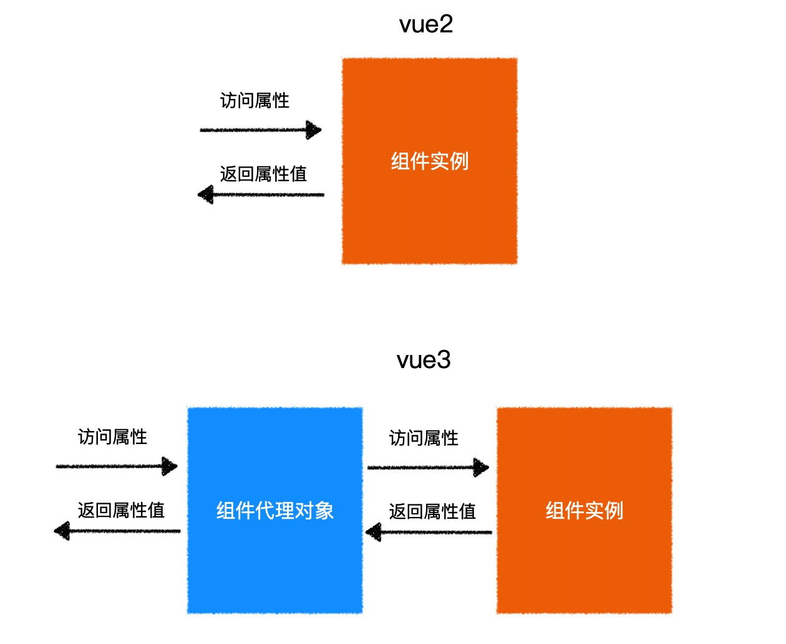

# Vue3的重大变化

## 不存在构造函数Vue
那怎么办呢,使用一种具名导出
```js
//main.js
import { createApp } from "vue";
import App from './App.vue';
const app = createApp(App);
app.mount("#app");//不再是$mount了
```
由于不存在构造函数Vue，故也无法使用其插件，即不能直接Vue.use(xxx)了，但是可以`app.use(xxx);`

## this指向的变化

vue3的this指向一个Proxy,vue2的this指向组件实例

## template中可以有多个根节点
只是vscode会给报错警告,但直接运行是没关系的,浏览器控制台也不会报任何错误

## composition api

**重点变化：options(配置) api  -->>  composition(组合) api**
options api的问题：满足了低耦合，但不满足高内聚，在复杂组件中，不易阅读与维护，比较零散，因为分散在了不同的配置项中

用了composition api后：低耦合，高内聚均满足，该干的事儿，都放在一起了，容易维护，更厉害的是，因为该放在一起的都在一起了，所以我们可以直接提取出去，成为一个新模块再引入即可。

### composition api如何使用：

#### setup

**setup(){},它会在所有生命周期钩子函数之前调用，它里面的this指向undefined,要 return 一个对象**

1. setup中如何做响应式呢？

```js
import { ref } from "vue";
setup() {
    let count = ref(0); //参数是默认值
    const increase = () => {
      count.value++;
    };

    return {
      count,
      increase,
    };
  },
```
